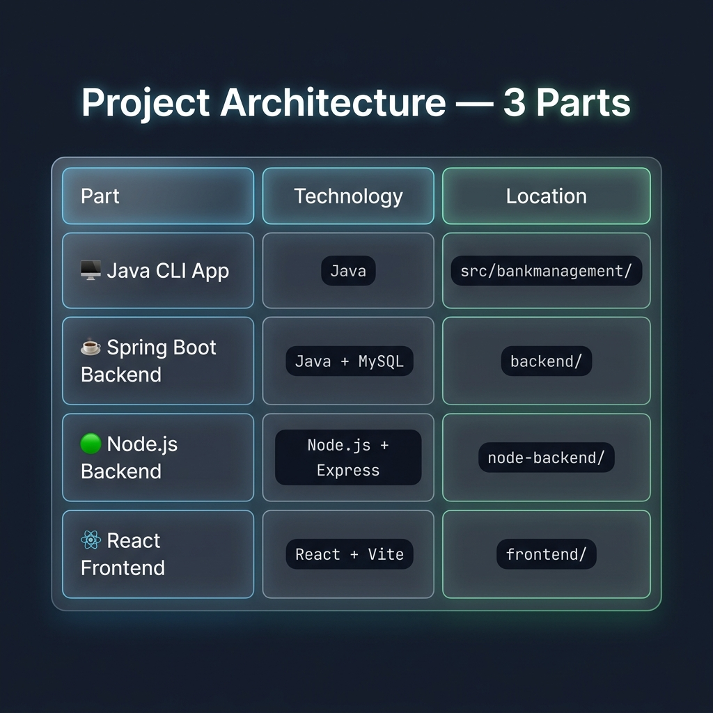

<div align="center">

# 🚀 NEXUS — Advanced Fintech Super App & Banking OS

## 🔥 [CLICK HERE FOR LIVE DEMO](https://nexus-bank-management-isvz.vercel.app/) 🔥

[](https://nexus-bank-management-isvz.vercel.app/)

<br />


</div>

---



**NEXUS** is a world-class, production-grade Fintech application designed to redefine the digital banking experience. Built with a focus on visual excellence and functional depth, it combines high-end financial analytics, real-time transaction logic, and a robust administrative ecosystem into a single, seamless "Super App" interface.

---

## 💎 Key Highlights

### ⚡ Neural Financial Dashboard
*   **Dynamic Net Worth Tracking:** Real-time balance updates with interactive Area Charts (Recharts).
*   **Budgeting Intelligence:** Visual goal tracking and upcoming bill management with automated progress monitoring.
*   **Quick-Action Ecosystem:** One-click transfers and rapid access to accounts.

### 🛡️ Quantum Security & Guard
*   **Deep System Audit:** Animated multi-layer security scanning interface.
*   **Ghost-Protocol Stealth:** Integrated network presence masking and stealth modes.
*   **Real-time Fraud Alerts:** Instant detection and notification of suspicious login attempts and international access.

### 📈 Global Investment Suite
*   **Stock Market Terminal:** Live-style candlestick/line graphs for portfolio tracking.
*   **Digital Gold Trading:** Integrated gold weight management with real-time valuation.
*   **Universal Wallet:** One-click buy/sell logic synced across all asset classes.

### 🚨 Nexus Command Center (Admin View)
*   **Global KYC Sync:** Centralized authorization hub for user identity verification.
*   **Fraud Mitigation:** Ability to "Freeze" suspicious accounts and investigate large transfers.
*   **Loan Execution:** Dedicated payout queue for managing enterprise-level disbursements.

### 🎨 Premium Design System
*   **Adaptive Theme Engine:** High-performance Dark/Light mode transition using global filters.
*   **Glassmorphism UI:** Multi-layered backdrop blurs, neon accents, and micro-animations.
*   **Responsive Control:** Optimized for a world-class desktop and tablet experience.

---

## 🛠️ Technology Stack

*   **Frontend:** [React.js](https://reactjs.org/) (Hooks, Context API)
*   **Styling:** [Tailwind CSS](https://tailwindcss.com/) (Custom Design Tokens)
*   **Visualization:** [Recharts](https://recharts.org/) (Professional Financial Charts)
*   **Icons:** [Lucide-React](https://lucide.dev/) (Thin-stroke precision icons)
*   **Animations:** CSS-in-JS + Tailwind Transitions
*   **Networking:** Axios (Production-ready API integration architecture)

---

## 🚀 Installation & Setup

1. **Clone the Repository**
   ```bash
   git clone https://github.com/yourusername/nexus-fintech-os.git
   ```

2. **Navigate to Frontend**
   ```bash
   cd frontend
   ```

3. **Install Dependencies**
   ```bash
   npm install
   ```

4. **Run Development Server**
   ```bash
   npm run dev
   ```

---

## 📸 Project Architecture

```text
.
├── frontend/                # React.js + Tailwind UI (Vite)
│   ├── src/components/      # Premium UI Atoms & Components
│   ├── src/App.jsx         # Core Application Logic & Router
│   └── src/index.css       # Design System & Global Styles
├── backend/                 # Java Spring Boot - Primary Financial Engine
│   ├── src/main/java/       # Business Logic, Entities, Repositories
│   └── pom.xml             # Maven Project Dependencies
├── node-backend/           # Express.js - Real-time Microservices
│   ├── models/             # Database Schemas (MongoDB)
│   └── seed.js             # Data Initialization & Migration
└── docker-compose.yml       # Production-ready Containerization Logic
```

---

## 👨‍💻 Developer Insight

> "NEXUS was built to demonstrate that financial software doesn't have to be boring. By combining **state-of-the-art design principles** with **complex state management**, I've created a platform that is as powerful as it is beautiful."

---

## 📜 License
Distributed under the MIT License. See `LICENSE` for more information.

---
<div align="center">
  <h3>Developed with ❤️ by Kajal Kumari</h3>
</div>
